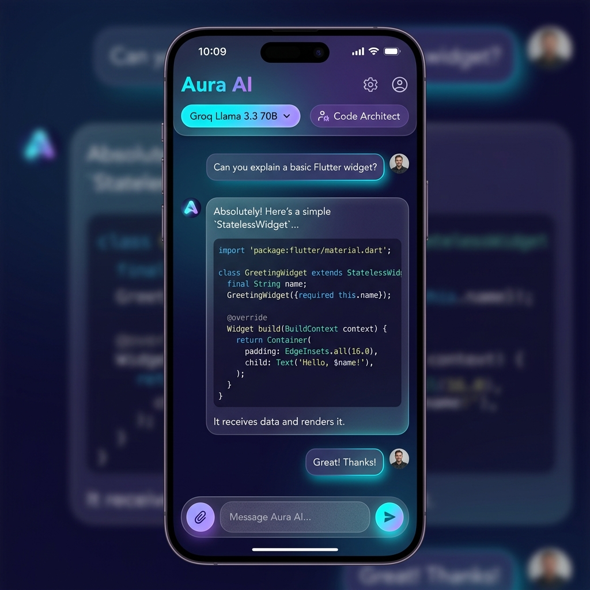
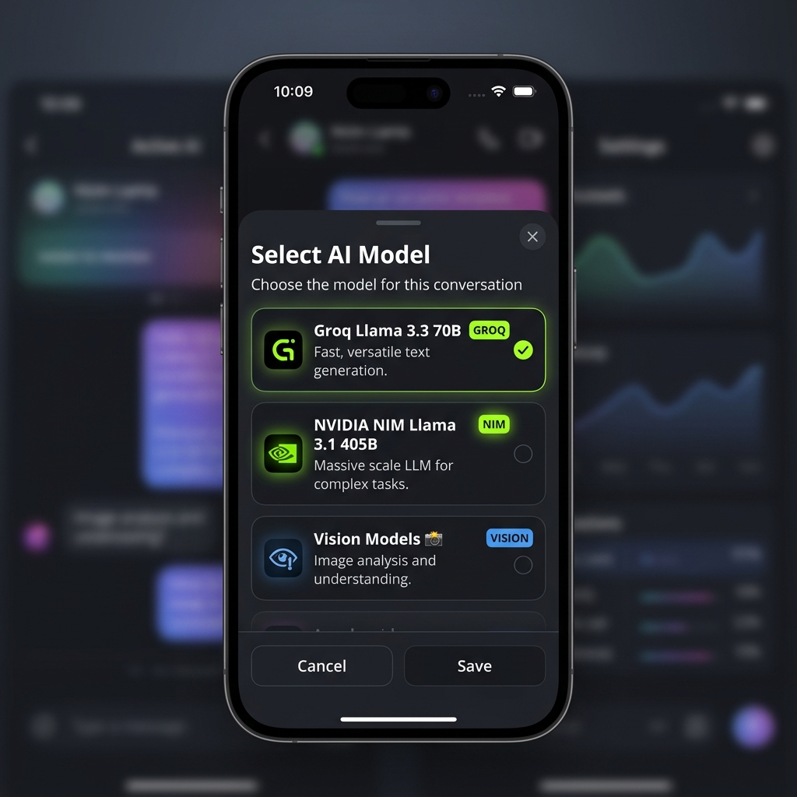
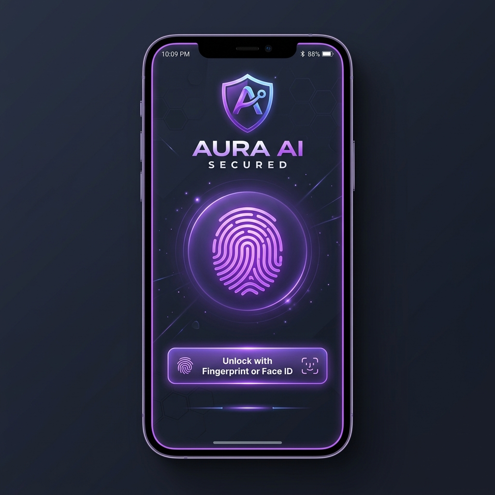

<div align="center">

# ⚡ Aura AI

**Privacy-First, High-Performance Multi-Model AI Assistant for Android**


*Aura AI is a modern Flutter application powered by Groq Llama 3.3 70B and NVIDIA NIM Llama 3.1 405B, featuring local SQLite data persistence, hardware KeyStore API key encryption, biometric app lock, image & document analysis, custom AI personas, personal memories, and chat exporting.*

---

### 📸 App Screenshots

| Chat Interface & SSE Streaming | AI Model Selector & Vision | Biometric App Lock & Privacy |
| :---: | :---: | :---: |
|  |  |  |

</div>

---

## ✨ Key Features

### 🚀 1. Multi-Provider AI Engine & SSE Streaming
- **Groq Llama 3.3 70B Versatile**: Ultra-fast inference streaming via Server-Sent Events (SSE).
- **NVIDIA NIM Cloud API**: Access massive open models including Llama 3.1 405B & Llama 3.2 Vision.
- **Dynamic Model Switcher**: Hot-swap AI models and providers mid-conversation.
- **Real-Time Progressive Rendering**: Watch AI responses stream character-by-character with full Markdown code syntax highlighting.

### 🛡️ 2. Zero-Cloud Privacy & Hardware KeyStore Encryption
- **100% Local Storage**: All chat history, user memories, custom prompts, and personas are stored on-device in SQLite.
- **Hardware KeyStore Encryption**: API keys are securely saved using Android's KeyStore API via `flutter_secure_storage`. Keys are never sent to external servers or logged.
- **Biometric App Lock**: Secure the application using Fingerprint or Face ID via `local_auth`. A full privacy lock overlay conceals conversation previews when locked.

### 📎 3. Multi-Modal Attachments (Images & Documents)
- **Image Analysis**: Upload JPG, PNG, and WebP images for visual analysis with Vision models.
- **Document Text Extraction**: Extract and parse text from PDF, TXT, DOCX, and CSV files directly on-device.
- **Smart Context Injection**: Document content is parsed and injected directly into the LLM prompt context safely up to context limits.

### 🧠 4. Personal Memories & Custom AI Personas
- **Personal Memory Bank**: User-controlled memories stored locally. Easily inspect, enable, disable, or delete what the AI knows about you.
- **Custom AI Personas**: Create system personas (e.g., Code Architect, Creative Writer, Executive Assistant) with custom system prompts and icons.
- **Prompt Library**: Pre-loaded starter prompts with search, category filtering, and custom prompt management.

### 📤 5. Comprehensive Chat Export Engine
- **Multiple Formats**: Export chat sessions to Plain Text (`.txt`), Markdown (`.md`), or structured JSON (`.json`).
- **Android Share Sheet Integration**: Share conversation exports directly to files, email, messaging, or cloud storage apps via `share_plus`.

---

## 🏗️ Architecture & Stack

```
lib/
├── core/
│   ├── router/          # GoRouter navigation & route guards
│   ├── services/        # Groq/NVIDIA LLM clients, Export, Biometrics, SecureStorage
│   └── theme/           # Premium dark theme, color tokens, typography
├── data/
│   ├── database/        # SQLite database (Drift engine)
│   └── repositories/    # Clean architecture repositories (Chat, Memory, Persona, Prompt)
├── features/
│   ├── auth/            # Biometric lock screen overlay
│   ├── chat/            # Chat workspace, message bubbles, composer bar, model selector
│   ├── memory/          # Personal memory bank management
│   ├── personas/        # Custom AI persona management
│   ├── privacy/         # Privacy & Data Security transparency screen
│   ├── prompts/         # Prompt library & category filtering
│   └── settings/        # API key management, model defaults, biometric toggle
└── models/              # Immutable domain entities & enums
```

- **Framework**: Flutter 3.27+ (Dart 3.6+)
- **State Management**: Flutter Riverpod 2.x (`NotifierProvider`, `StreamProvider`)
- **Navigation**: GoRouter 14.x
- **Database**: Drift 2.x (SQLite engine)
- **Secure Storage**: `flutter_secure_storage` (Android KeyStore API)
- **Biometrics**: `local_auth` 2.3+ (Fingerprint / Biometric Prompt API)
- **Document Parsing**: `syncfusion_flutter_pdf` & `archive` (Zip decoder)
- **Exporting**: `share_plus` 10.0+

---

## 📦 Getting Started

### Prerequisites
- Flutter SDK `^3.27.0`
- Android Studio / Android SDK (API 21+)
- Groq API Key ([Get Groq Key](https://console.groq.com/keys)) or NVIDIA NIM API Key ([Get NVIDIA Key](https://build.nvidia.com/))

### Installation

1. **Clone repository**:
   ```bash
   git clone https://github.com/YOUR_GITHUB_USERNAME/aura_ai.git
   cd aura_ai
   ```

2. **Install dependencies**:
   ```bash
   flutter pub get
   ```

3. **Run code generation (if modifying database models)**:
   ```bash
   dart run build_runner build --delete-conflicting-outputs
   ```

4. **Run application**:
   ```bash
   flutter run
   ```

---

## 🔨 Building Release APK

To build an optimized, standalone release APK for installation on Android devices:

```bash
flutter build apk --release
```

The compiled APK will be generated at:
`build/app/outputs/flutter-apk/app-release.apk`

---

## 🔒 Privacy Disclosure

- **Zero Cloud Database**: Aura AI operates without any central user database or analytics tracking.
- **Local SQLite Engine**: All chats, settings, and memories reside strictly on your local device storage.
- **Hardware KeyStore**: API keys are saved exclusively in encrypted Android system storage.
- **Direct Cloud API Connection**: API calls are transmitted directly between your app and the provider's HTTPS endpoints (Groq / NVIDIA) without intermediate proxy servers.

---

## 📄 License

This project is licensed under the [MIT License](LICENSE).
